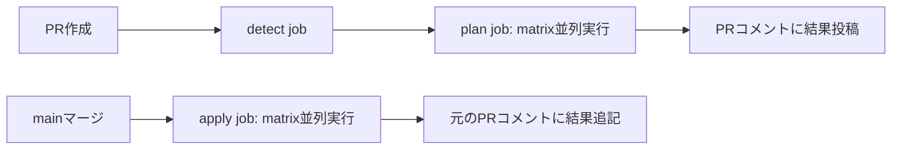

こんにちは。PIVOTでソフトウェアエンジニアとして、Webフロントエンド、バックエンド、インフラを横断的に担当している[@tawachan](https://x.com/tawachan39)です。

[前回の記事](リンクを挿入)では、PIVOTのTerraform構成設計について紹介しました。モノレポ × リソース種別ベースの構成により、AI時代のインフラ運用を見据えた設計を実現しました。

構成設計に加えて、GitOpsフロー（PR→plan、merge→apply）を構築することで、レビュープロセスを経た安全なインフラ変更を実現しています。

## GitOpsフローの必要性

GitOpsは今や基本的な要件ですが、改めて確認しておきます。ローカルでTerraform applyする運用では、以下の問題がありました：

- **変更履歴の追跡**: いつ誰が何を変更したのか記録が残らない
- **レビュープロセスの欠如**: チェックなしで本番環境に変更が反映されてしまう
- **ロールバックの困難**: 問題が起きた際、以前の状態に戻すのが難しい
- **監査性の欠如**: コンプライアンス要件を満たせない

GitOpsフロー（PR→plan、merge→apply）を構築することで、これらの課題を解決し、**必ずレビューを経た変更のみが適用される**という基本を押さえる必要がありました。

## GitOps実装の選択肢

Terraform管理の自動化には、意外と多くのツールや選択肢があります：

- **[tfaction](https://github.com/suzuki-shunsuke/tfaction)**: Terraform管理に特化したGitHub Actionsライブラリ
- **[Atlantis](https://www.runatlantis.io/)**: Terraform用のPull Requestオートメーションサーバー
- **[Terragrunt](https://terragrunt.gruntwork.io/)**: Terraformのラッパーツール、DRYな構成管理
- **自前実装**: GitHub Actionsで独自のワークフローを構築

それぞれに長所短所があり、チーム規模や要件によって最適解は変わります。我々は最終的に**自前実装**を選択しました。この記事では、その理由と、**複数のTerraform Stateを効率的に管理する自前GitHub Actionsワークフローの実装**について詳しく解説します。

## 前提: 複数StateでのTerraform管理

PIVOTでは、Terraformのstateをリソース種別ごとに分割して管理しています：

```text
platform/google-cloud/
├── pivot-stg/
│   ├── cloud-run/        # stateファイル: stg/cloud-run
│   ├── cloud-run-jobs/   # stateファイル: stg/cloud-run-jobs
│   ├── iam/              # stateファイル: stg/iam
│   └── ...
└── pivot-prod/
    └── ...（同上）
```

この構成により、以下のメリットがあります：

- stateの肥大化を避ける
- 影響範囲を限定
- 異なるリソース種別を並行して作業できる

しかし、複数のstateを管理するには、適切なCI/CDの仕組みが必要です。

## なぜ自前実装を選んだのか

### tfactionの検討と断念

Terraform管理の自動化には[tfaction](https://github.com/suzuki-shunsuke/tfaction)という優れたツールがあります。当初これを検討しましたが、以下の理由で採用を見送りました：

1. **準備にハマりポイントが多い**: ライブラリとしての使い方を理解するのに意外と時間がかかる
2. **ブラックボックス問題**: 内部の動作が見えづらく、問題が起きたときのデバッグが困難
3. **AI時代の技術選定**: **ライブラリを追うより、自前のワークフローの方がAIが理解・改善しやすい**

特に3点目が重要でした。Claude CodeやCodex CLIで「この部分を改善して」と指示する際、自前のワークフロー記述なら、AIが全体を理解して適切な変更を提案できます。ライブラリの場合、AIもドキュメントを参照する必要があり、効率が落ちます。

### AI時代の技術選定の変化

「自前でコードを書く方がAIには親和的」という判断は、従来の技術選定とは異なるアプローチです。以前なら「車輪の再発明を避ける」べく、実績のあるライブラリを選ぶのが定石でした。しかしAI時代では、**ワークフローの処理が明示的に記述されている方が、AIによる理解・改善・拡張が容易**という新しい判断軸が生まれています。

もちろん、tfactionは素晴らしいツールであり、大規模な組織や複雑な要件には適しています。ただ、小規模チームでAI支援を前提とする場合、シンプルな自前実装の方が機動力が高いと判断しました[^tfaction-challenges]。

[^tfaction-challenges]: tfactionの導入時のハマりポイントについては、[こちらの記事](https://zenn.dev/bm_sms/articles/d09886634c9bab)も参考になります。我々も同様の温度感で検討し、最終的に自前実装を選択しました。

## 実装の全体像

GitHub Actionsでの実装は、以下の3つのジョブで構成されています：

1. **detect**: 変更されたディレクトリを検出し、対象stackのリストを作成
2. **plan**: 各stackに対してTerraform planを実行し、結果をPRコメントに投稿
3. **apply**: mainブランチマージ時に各stackに対してTerraform applyを実行

### ワークフロー全体の流れ



## 実装の詳細

### 1. 変更検知とStackリスト作成

まず、どのディレクトリが変更されたかを検出し、対象となるstackのリストを作成します。

```yaml
jobs:
  detect:
    runs-on: ubuntu-latest
    outputs:
      stacks: ${{ steps.stacks.outputs.list }}
      count: ${{ steps.stacks.outputs.count }}
    steps:
      - name: Checkout repository
        uses: actions/checkout@v4

      - name: Detect changed paths
        id: filter
        uses: dorny/paths-filter@v3
        with:
          list-files: json
          filters: |
            modules_all:
              - 'modules/**'
            stg_cloud_run:
              - 'platform/google-cloud/pivot-stg/cloud-run/**'
            stg_cloud_run_jobs:
              - 'platform/google-cloud/pivot-stg/cloud-run-jobs/**'
            stg_iam:
              - 'platform/google-cloud/pivot-stg/iam/**'
            prod_cloud_run:
              - 'platform/google-cloud/pivot-prod/cloud-run/**'
            # ... 他のstackも同様に定義
```

#### paths-filterの活用

[dorny/paths-filter](https://github.com/dorny/paths-filter)を使うことで、変更されたパスを検出できます。各stackに対応するディレクトリを定義し、変更があればフラグが立ちます。

#### Stackリストのビルド

変更検知の結果を元に、対象stackのJSON配列を作成します：

```yaml
      - name: Build affected stacks matrix
        id: stacks
        shell: bash
        run: |
          set -euo pipefail
          stacks=()

          # modules/**が変更された場合、全stackを対象にする
          if [[ "${{ steps.filter.outputs.modules_all }}" == 'true' ]]; then
            stacks+=(
              platform/google-cloud/pivot-stg/cloud-run
              platform/google-cloud/pivot-stg/cloud-run-jobs
              # ... 全stackを列挙
            )
          else
            # 個別の変更を検出
            [[ "${{ steps.filter.outputs.stg_cloud_run }}" == 'true' ]] && \
              stacks+=(platform/google-cloud/pivot-stg/cloud-run)
            [[ "${{ steps.filter.outputs.stg_cloud_run_jobs }}" == 'true' ]] && \
              stacks+=(platform/google-cloud/pivot-stg/cloud-run-jobs)
            # ... 他のstackも同様
          fi

          # JSON配列を構築
          if [ "${#stacks[@]}" -gt 0 ]; then
            json="[\"${stacks[0]}\""
            for ((i=1;i<${#stacks[@]};i++)); do
              json="$json, \"${stacks[i]}\""
            done
            json="$json]"
          else
            json="[]"
          fi

          echo "list=$json" >> "$GITHUB_OUTPUT"
          echo "count=${#stacks[@]}" >> "$GITHUB_OUTPUT"
```

**ポイント:**

- `modules/**`が変更された場合は、そのmoduleを使用する全stackに対してplanを実行
- それ以外は変更されたstackのみを対象にする
- GitHub Actionsのmatrix strategyで使えるJSON配列を出力

### 2. Plan jobの実装

検出されたstackに対して、並列にTerraform planを実行します。

```yaml
  plan:
    needs: detect
    if: ${{ needs.detect.outputs.count != '0' }}
    runs-on: ubuntu-latest
    strategy:
      fail-fast: false
      matrix:
        stack: ${{ fromJson(needs.detect.outputs.stacks) }}
    concurrency:
      group: tf-${{ matrix.stack }}
      cancel-in-progress: false
    defaults:
      run:
        working-directory: ${{ matrix.stack }}
```

#### Matrix strategyによる並列実行

GitHub Actionsの[matrix strategy](https://docs.github.com/en/actions/using-jobs/using-a-matrix-for-your-jobs)を使うことで、複数のstackに対して並列にjobを実行できます。

- `fromJson()`で、detectジョブで作成したJSON配列をmatrixに展開
- `fail-fast: false`で、1つのstackが失敗しても他のstackの実行を継続
- `concurrency`で、同じstackに対する同時実行を防止

実際の実行例：


detectジョブで対象stackを検出後、planとapplyがそれぞれmatrixで並列実行されています。この例では2つのstackが同時に処理されています。

#### 環境別のサービスアカウント解決

stgとprodで異なるサービスアカウントを使い分けます：

```yaml
      - name: Resolve plan service account
        id: sa_plan
        shell: bash
        run: |
          stack="${{ matrix.stack }}"
          if [[ "$stack" == *"pivot-prod/"* ]]; then
            echo "sa=[prod-service-account-email]" >> "$GITHUB_OUTPUT"
          else
            echo "sa=[stg-service-account-email]" >> "$GITHUB_OUTPUT"
          fi

      - name: Resolve plan WIF provider
        id: wif_plan
        shell: bash
        run: |
          stack="${{ matrix.stack }}"
          if [[ "$stack" == *"pivot-prod/"* ]]; then
            echo "wif=projects/[prod-project-number]/locations/global/workloadIdentityPools/[pool-name]/providers/[provider-name]" >> "$GITHUB_OUTPUT"
          else
            echo "wif=projects/[stg-project-number]/locations/global/workloadIdentityPools/[pool-name]/providers/[provider-name]" >> "$GITHUB_OUTPUT"
          fi
```

stackのパスに`pivot-prod/`が含まれているかで環境を判定し、対応するWorkload Identity ProviderとサービスアカウントIDを設定します。

#### Workload Identity Federationによる認証

```yaml
      - name: Authenticate with Google Cloud (plan)
        id: auth
        uses: google-github-actions/auth@v2
        with:
          workload_identity_provider: ${{ steps.wif_plan.outputs.wif }}
          service_account: ${{ steps.sa_plan.outputs.sa }}
```

サービスアカウントキー不要で、GitHub ActionsからGoogle Cloudに安全に認証できます。

#### Terraform planの実行

```yaml
      - name: Run Terraform plan
        id: do_plan
        shell: bash
        run: |
          set -euo pipefail
          set +e
          terraform plan -input=false -no-color -detailed-exitcode | tee plan.txt
          code=${PIPESTATUS[0]}
          set -e
          echo "exitcode=$code" >> "$GITHUB_OUTPUT"

          if [ "$code" -eq 2 ]; then
            # 変更がある場合、tfplanファイルも生成
            terraform plan -input=false -no-color -out=plan.tfplan >/dev/null
          elif [ "$code" -eq 1 ]; then
            echo "::error::terraform plan failed"
            exit 1
          fi
```

**ポイント:**

- `-detailed-exitcode`で、変更有無を終了コードで判定（0=変更なし、1=エラー、2=変更あり）
- `tee`でplan結果をファイルに保存し、後続のPRコメント投稿で使用
- `${PIPESTATUS[0]}`でパイプ前のコマンドの終了コードを取得

#### PRコメントの作成と投稿

```yaml
      - name: Prepare plan comment
        if: github.event_name == 'pull_request'
        env:
          PLAN_EXIT: ${{ steps.do_plan.outputs.exitcode }}
        run: |
          set -euo pipefail
          STACK="${{ matrix.stack }}"
          PLAN_OUT=$(sed -e 's/\x1b\[[0-9;]*m//g' plan.txt)
          SUMMARY_LINE=$(printf "%s\n" "$PLAN_OUT" | (grep -E '^Plan: |^No changes' || true) | tail -n1)

          : > plan-comment.md
          {
            echo "<!-- tfstack: ${STACK} -->"
            echo "### Terraform Plan: ${STACK}"
            if [ -n "$SUMMARY_LINE" ]; then
              echo
              echo '```'
              echo "${SUMMARY_LINE}"
              echo '```'
            fi
            echo
            echo "<details><summary>Show full plan</summary>"
            echo
            echo '```terraform'
            printf "%s\n" "$PLAN_OUT"
            echo '```'
            echo
            echo '</details>'
          } >> plan-comment.md

      - name: Find existing plan comment
        if: github.event_name == 'pull_request'
        id: find_comment
        uses: peter-evans/find-comment@v3
        with:
          issue-number: ${{ github.event.pull_request.number }}
          comment-author: 'github-actions[bot]'
          body-includes: "<!-- tfstack: ${{ matrix.stack }} -->"

      - name: Update or create plan comment
        if: github.event_name == 'pull_request'
        uses: peter-evans/create-or-update-comment@v4
        with:
          comment-id: ${{ steps.find_comment.outputs.comment-id }}
          issue-number: ${{ github.event.pull_request.number }}
          body-file: ${{ matrix.stack }}/plan-comment.md
          edit-mode: ${{ steps.find_comment.outputs.comment-id != '' && 'replace' || 'append' }}
```

**ポイント:**

- `<!-- tfstack: ${STACK} -->`というHTMLコメントでstack識別
- 既存コメントがあれば更新、なければ新規作成
- `<details>`タグでfull planを折りたたみ表示
- ANSI escape sequenceを除去して見やすく

実際のPRコメント例：


Terraform plan結果がPRコメントに自動投稿され、変更内容が可視化されます。mainブランチへのマージで自動applyが実行され、完了すると元のPRコメントに結果が追記されます。

### 3. Apply jobの実装

mainブランチへのマージ時に、applyを実行します。

```yaml
  apply:
    needs: [detect, plan]
    if: github.event_name == 'push' && needs.detect.outputs.count != '0'
    runs-on: ubuntu-latest
    strategy:
      fail-fast: false
      matrix:
        stack: ${{ fromJson(needs.detect.outputs.stacks) }}
    # ... (認証周りはplan jobと同様)
```

#### マージ元のPR番号を解決

apply結果を元のPRコメントに追記するため、マージ元のPR番号を取得します：

```yaml
      - name: Resolve merged PR number
        id: pr
        if: github.event_name == 'push'
        shell: bash
        env:
          GH_TOKEN: ${{ secrets.GITHUB_TOKEN }}
        run: |
          set -euo pipefail
          # GitHub APIでcommitに紐づくPRを取得
          PR_NUM=$(gh api \
            -H "Accept: application/vnd.github+json" \
            "/repos/${{ github.repository }}/commits/${{ github.sha }}/pulls" \
            --jq '.[0].number' 2>/dev/null || true)

          if [ -z "$PR_NUM" ] || [ "$PR_NUM" = "null" ]; then
            # Fallback: commit messageから抽出
            PR_NUM=$(git log -1 --pretty=%B \
              | grep -oE '\(#([0-9]+)\)|#([0-9]+)' \
              | grep -oE '[0-9]+' \
              | head -n1 || true)
          fi

          echo "number=${PR_NUM}" >> "$GITHUB_OUTPUT"
```

**ポイント:**

- GitHub APIで確実にPR番号を取得
- Fallbackとしてcommit messageからも抽出
- Squash mergeにも対応

#### Apply結果をPRコメントに追記

```yaml
      - name: Find plan comment for apply result
        if: steps.pr.outputs.number != ''
        id: find_plan_comment
        uses: peter-evans/find-comment@v3
        with:
          issue-number: ${{ steps.pr.outputs.number }}
          comment-author: 'github-actions[bot]'
          body-includes: "<!-- tfstack: ${{ matrix.stack }} -->"

      - name: Append apply result to plan comment
        if: steps.pr.outputs.number != '' && steps.find_plan_comment.outputs.comment-id != ''
        uses: peter-evans/create-or-update-comment@v4
        with:
          comment-id: ${{ steps.find_plan_comment.outputs.comment-id }}
          edit-mode: append
          body-file: ${{ matrix.stack }}/apply-comment.md
```

plan時に投稿したコメントを見つけ、apply結果を追記します。これにより、plan結果とapply結果が同じコメント内に並び、変更の意図と実際の適用結果を一箇所で確認できます。

## 実現できたこと

この仕組みにより、以下を実現しました：

### 1. 効率的な並列実行

複数のstackを同時に変更しても、それぞれ並列にplan/applyが実行されます。例えば、`cloud-run`と`iam`を同時に変更した場合、両方のstackに対して並列にjobが走り、それぞれPRコメントが投稿されます。

### 2. 影響範囲の最小化

変更されたstackのみが処理されるため、無関係なリソースへの影響を避けられます。

### 3. モジュール変更の影響確認

`modules/`配下が変更された場合、そのmoduleを使用する全stackに対してplanが実行されるため、影響範囲を事前に確認できます。

### 4. 安全な権限管理

- planとapplyで異なるサービスアカウントを使用
- Workload Identity Federationによるキーレス認証
- 環境（stg/prod）ごとに分離されたIdentity

### 5. 変更履歴とレビュープロセス

全ての変更がPR経由で行われ、plan結果が可視化されるため、レビューしやすく、変更履歴も明確です。

## AI時代の自前実装のメリット

この実装を通じて、AI時代における自前実装のメリットを実感しました：

### 1. AIによる理解が容易

「この部分のエラーハンドリングを改善して」「新しい環境を追加して」といった指示に対し、Claude CodeやCodex CLIが全体を理解して適切な変更を提案できます。

### 2. デバッグと改善が高速

問題が起きた際、ワークフローを直接見れば何が起きているかすぐわかります。AIにも「ここでエラーが出た」と伝えれば、即座に原因を特定して修正案を提示してくれます。

### 3. カスタマイズの柔軟性

「stg環境だけplan結果をSlackに通知して」といった独自要件も、既存のワークフローを拡張するだけで実現できます。

### 4. チームの学習コスト

新しいメンバーが参加しても、GitHub Actionsのワークフローを見れば、何が起きているか理解できます。ライブラリのドキュメントを読む必要がありません。

## まとめ

複数のTerraform Stateを管理するCI/CDは、一見複雑に見えますが、以下の要素を組み合わせることで実現できます：

- **dorny/paths-filter**による変更検知
- **Matrix strategy**による並列実行
- **Workload Identity Federation**による安全な認証
- **peter-evans/create-or-update-comment**によるPRコメント管理

そして、AI時代においては、**ブラックボックスなライブラリよりも、明示的なワークフロー記述の方が、理解・改善・拡張が容易**という新しい判断軸が生まれています。

tfactionのような優れたツールも存在しますが、小規模チームでAI支援を前提とする場合、シンプルな自前実装が機動力を高めることがあります。チームの状況に応じて、最適な技術選定を行うことが重要です。

この記事が、同じような課題に取り組むチームの参考になれば幸いです。

## 参考資料

- [dorny/paths-filter](https://github.com/dorny/paths-filter)
- [GitHub Actions: Matrix strategy](https://docs.github.com/en/actions/using-jobs/using-a-matrix-for-your-jobs)
- [Workload Identity Federation](https://cloud.google.com/iam/docs/workload-identity-federation)
- [tfaction導入時の課題](https://zenn.dev/bm_sms/articles/d09886634c9bab)
